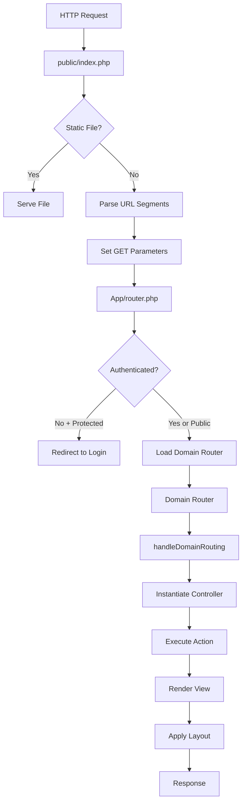

# Architecture Overview

Zoo Arcadia follows a **screaming architecture** pattern (also known as domain-driven design), where the codebase structure immediately reveals what the application does rather than which framework it uses.

## Core Architectural Principles

The application is built around three fundamental concepts:

1. **Domain-Driven Structure**: Each business domain (animals, habitats, users, etc.) is a self-contained module
2. **MVC Within Domains**: Each domain implements its own Model-View-Controller pattern
3. **Centralized Routing with Domain Delegation**: A central router handles security, then delegates to domain-specific routers

<Note>
Unlike traditional PHP frameworks that organize code by technical layers (controllers/, models/, views/), Zoo Arcadia organizes by business domains. This makes the codebase "scream" its purpose: "I'm a zoo management system!"
</Note>

## Project Structure

Here's the high-level directory organization:

```
zoo-ARCADIA/
├── App/                      # Domain modules (business logic)
│   ├── animals/              # Animals domain
│   │   ├── controllers/      # Animal controllers
│   │   ├── models/           # Animal models
│   │   ├── views/            # Animal views
│   │   └── animalsRouter.php # Domain router
│   ├── habitats/             # Habitats domain
│   ├── users/                # Users domain
│   ├── employees/            # Employees domain
│   ├── testimonials/         # Testimonials domain
│   ├── auth/                 # Authentication domain
│   └── router.php            # Central router ("The Guard")
├── public/                   # Web root
│   ├── index.php             # Front controller ("The Porter")
│   └── build/                # Compiled assets
├── includes/                 # Shared utilities
│   ├── functions.php         # Helper functions
│   ├── layouts/              # Layout templates
│   └── templates/            # Reusable components
├── database/                 # SQL scripts
│   ├── 01_structure.sql      # Database schema
│   ├── 02_data.sql           # Sample data
│   └── 03_constraints.sql    # Constraints
└── src/                      # Source assets (SCSS/JS)
```

## Request Flow Diagram

Every HTTP request follows this path:



<Accordion title="Detailed Request Flow Explanation">

1. **Front Controller** (`public/index.php`) receives all requests
2. **Static File Check**: If it's a CSS/JS/image file, serve it directly
3. **URL Parsing**: Extract domain, controller, and action from the URL
4. **Central Router** (`App/router.php`) validates session and permissions
5. **Domain Router**: Loads the appropriate domain router (e.g., `animalsRouter.php`)
6. **Controller Instantiation**: Creates the controller instance
7. **Action Execution**: Calls the requested method on the controller
8. **View Rendering**: Includes the appropriate view file
9. **Layout Application**: Wraps the view in the appropriate layout (public or back-office)

</Accordion>

## Domain Organization

Each domain is a self-contained module with its own MVC structure:

<CodeGroup>

```php Animals Domain
App/animals/
├── animalsRouter.php          # Routes requests to controllers
├── controllers/
│   ├── animals_pages_controller.php
│   ├── animals_gest_controller.php     # Management (back-office)
│   └── animals_feeding_controller.php
├── models/
│   ├── animalFull.php
│   ├── specie.php
│   └── nutrition.php
└── views/
    ├── pages/                 # Public views
    ├── gest/                  # Management views
    └── feeding/               # Feeding views
```

```php Habitats Domain
App/habitats/
├── habitatsRouter.php
├── controllers/
│   ├── habitats_pages_controller.php
│   └── habitats_gest_controller.php
├── models/
│   └── habitat.php
└── views/
    ├── pages/
    └── gest/
```

```php Users Domain
App/users/
├── usersRouter.php
├── controllers/
│   └── users_gest_controller.php
├── models/
│   └── user.php
└── views/
    └── gest/
```

</CodeGroup>

## Key Architectural Decisions

### 1. Singleton Database Connection

The application uses a singleton pattern for database connections to prevent multiple connections and ensure efficient resource usage.

```php database/connection.php
$db = Database::getInstance()->getConnection();
```

### 2. Session Management

Sessions are configured with security-first settings:

- **Secure cookies**: HTTPS-only in production
- **HttpOnly flag**: Prevents XSS attacks from stealing session cookies
- **SameSite=Lax**: CSRF protection while allowing external links
- **Session timeout**: 11-hour automatic expiration

### 3. CSRF Protection

All forms that modify data include CSRF tokens validated on the server.

### 4. Permission-Based Access Control

The application implements role-based permissions stored in the session:

```php
if (hasPermission('animals-create')) {
    // Allow animal creation
}
```

<Warning>
The central router (`App/router.php`) enforces authentication for all non-public domains. Never bypass this router, as it's the security gateway for the entire application.
</Warning>

## URL Structure

Zoo Arcadia uses clean URLs following this pattern:

```
/{domain}/{controller}/{action}?param=value
```

Examples:
- `/animals/pages/allanimals` - Public animals listing
- `/animals/gest/create` - Create animal (back-office)
- `/animals/pages/animalpicked?id=5` - View specific animal
- `/habitats/pages/habitats` - Public habitats page
- `/auth/pages/login` - Login page

## Layout System

The application uses two main layouts:

1. **FC_main_layout.php**: Front-office (public) layout with visitor navigation
2. **BO_main_layout.php**: Back-office layout with admin navigation and permissions

The `handleDomainRouting()` function automatically selects the appropriate layout based on the domain and action.

## Next Steps

Explore the specific architectural components:

<CardGroup cols={3}>
  <Card title="Front Controller" icon="door-open" href="/architecture/front-controller">
    Learn how requests enter the application
  </Card>
  <Card title="Routing System" icon="route" href="/architecture/routing">
    Understand authentication and routing logic
  </Card>
  <Card title="Domain Structure" icon="folder-tree" href="/architecture/domain-structure">
    Dive into domain-driven MVC organization
  </Card>
</CardGroup>