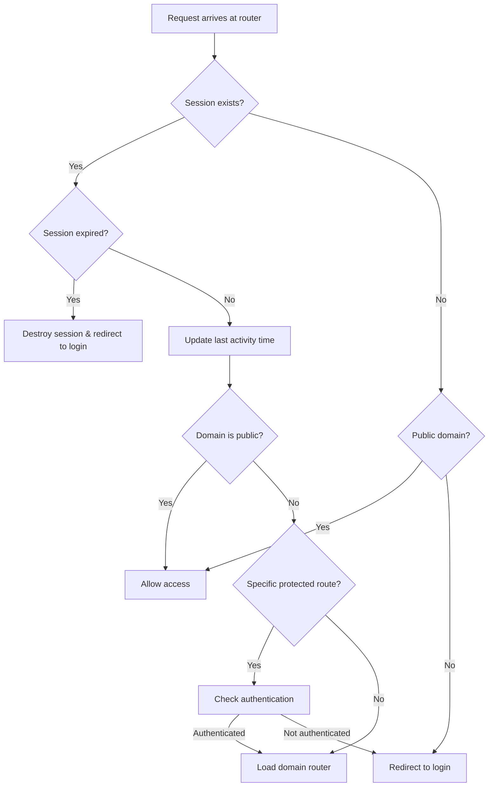

# Routing System

The **central router** (`App/router.php`) is "The Guard" of Zoo Arcadia. After the front controller parses the URL, the central router handles:

- Session management and timeout
- Authentication verification
- Public vs. protected route enforcement
- Domain whitelist validation
- Delegation to domain-specific routers

## Central Router Overview

The central router acts as a security gateway before any domain logic executes:

```php App/router.php (simplified)
<?php
session_start();

// 1. Disable browser cache
header("Cache-Control: no-store, no-cache, must-revalidate, max-age=0");
header("Pragma: no-cache");

$domain = $_GET["domain"] ?? "home";

// 2. Define public domains (no authentication required)
$public_domains = [
    "auth", "contact", "home", "about", 
    "habitats", "animals", "cms", "testimonials"
];

// 3. Session timeout check (11 hours)
if (isset($_SESSION["user"]["username"])) {
    $sessionTimeout = 39600; // 11 hours in seconds
    $lastActivity = $_SESSION["last_activity"] ?? time();
    
    if (time() - $lastActivity > $sessionTimeout) {
        // Session expired: destroy and redirect
        $_SESSION = array();
        session_destroy();
        header("Location: /auth/pages/login?msg=session_expired");
        exit();
    } else {
        // Update last activity time
        $_SESSION["last_activity"] = time();
    }
}

// 4. Main authentication check
if (!isset($_SESSION["user"]["username"]) && !in_array($domain, $public_domains)) {
    header("Location: /auth/pages/login");
    exit();
}

// 5. Load domain router
$allowed_domains = [
    "auth", "home", "animals", "habitats", "users",
    "employees", "testimonials", "contact", "roles",
    "permissions", "schedules", "reports", "vreports"
];

if (in_array($domain, $allowed_domains)) {
    $domainRouterPath = __DIR__ . "/{$domain}/{$domain}Router.php";
    
    if (file_exists($domainRouterPath)) {
        require_once $domainRouterPath;
    } else {
        http_response_code(500);
        header('Location: /public/error-500.php');
        exit();
    }
} else {
    http_response_code(404);
    header('Location: /public/error-404.php');
    exit();
}
```

## Authentication Flow

Here's how authentication is enforced:



## Public vs. Protected Domains

The router distinguishes between public and protected domains:

<CodeGroup>

```php Public Domains (No Auth Required)
$public_domains = [
    "auth",          // Login, logout, register
    "contact",       // Contact form
    "home",          // Homepage (except /home/pages/start dashboard)
    "about",         // About page
    "habitats",      // Public habitat listing
    "animals",       // Public animal listing
    "cms",           // CMS pages
    "testimonials"   // Public testimonials display
];
```

```php Protected Domains (Auth Required)
// Any domain NOT in $public_domains requires authentication
$protected_domains = [
    "users",         // User management
    "employees",     // Employee management
    "roles",         // Role management
    "permissions",   // Permission management
    "schedules",     // Schedule management
    "reports",       // Reports
    "vreports"       // Veterinary reports
];
```

</CodeGroup>

<Note>
Some public domains have mixed routes. For example, `animals` is public, but `/animals/gest/create` (management) requires authentication. The router includes specific checks for these cases.
</Note>

## Session Timeout Management

The router implements an 11-hour session timeout:

```php
if (isset($_SESSION["user"]["username"])) {
    $sessionTimeout = 39600; // 11 hours in seconds
    $lastActivity = $_SESSION["last_activity"] ?? time();
    
    if (time() - $lastActivity > $sessionTimeout) {
        // Session expired: destroy completely
        $_SESSION = array();
        
        // Also delete the session cookie
        if (ini_get("session.use_cookies")) {
            $params = session_get_cookie_params();
            setcookie(session_name(), '', time() - 42000,
                $params["path"], $params["domain"],
                $params["secure"], $params["httponly"]
            );
        }
        
        session_destroy();
        header("Location: /auth/pages/login?msg=session_expired");
        exit();
    } else {
        // Update last activity time
        $_SESSION["last_activity"] = time();
    }
    
    // Validate session data integrity
    if (!isset($_SESSION["user"]["id_user"]) || 
        !isset($_SESSION["loggedin"]) || 
        $_SESSION["loggedin"] !== true) {
        // Invalid session: destroy it
        $_SESSION = array();
        session_destroy();
        header("Location: /auth/pages/login?msg=invalid_session");
        exit();
    }
}
```

<Accordion title="Why 11 Hours?">

The 11-hour timeout represents a full working day plus buffer:

- **8-hour workday**: Standard shift for zoo employees
- **3-hour buffer**: Lunch breaks, meetings, idle time
- **Security balance**: Long enough for usability, short enough for security

If a user is inactive for 11 hours, their session expires and they must log in again. However, each action they take resets the timer.

</Accordion>

## Granular Route Protection

Some domains are public but have protected controllers. The router includes specific checks:

### Protected Routes in Public Domains

```php
// Global protection for management controllers
$controller = $_GET['controller'] ?? '';
if ($controller === 'gest' && !isset($_SESSION["user"]["username"])) {
    header("Location: /auth/pages/login");
    exit();
}

// Animals domain: feeding and gest require auth
if ($domain === "animals") {
    $controller = $_GET['controller'] ?? '';
    if (in_array($controller, ['feeding', 'gest']) && 
        !isset($_SESSION["user"]["username"])) {
        header("Location: /auth/pages/login");
        exit();
    }
}

// Habitats domain: gest and suggestion require auth
if ($domain === "habitats") {
    $controller = $_GET['controller'] ?? '';
    if (in_array($controller, ['gest', 'suggestion']) && 
        !isset($_SESSION["user"]["username"])) {
        header("Location: /auth/pages/login");
        exit();
    }
}

// Home domain: dashboard (/home/pages/start) requires auth
if ($domain === "home" && $_GET["action"] === "start" && 
    !isset($_SESSION["user"]["username"])) {
    header("Location: /auth/pages/login");
    exit();
}
```

<CodeGroup>

```text Public Routes in Animals Domain
✅ /animals/pages/allanimals       (public listing)
✅ /animals/pages/animalpicked     (public detail page)
```

```text Protected Routes in Animals Domain
🔒 /animals/gest/create            (management)
🔒 /animals/gest/edit              (management)
🔒 /animals/feeding/add            (feeding records)
```

</CodeGroup>

## Preventing Login Loops

The router prevents authenticated users from accessing the login page:

```php
// If already authenticated and trying to access login, redirect to dashboard
if (isset($_SESSION["user"]["username"]) && 
    $domain === "auth" && 
    $_GET["action"] === "login") {
    header("Location: /home/pages/start");
    exit();
}
```

This improves user experience and prevents infinite redirect loops.

## Domain Whitelist Validation

The router only loads domains that are explicitly allowed:

```php
$allowed_domains = [
    "hero", "medias", "habitat1", "cms", "about", 
    "auth", "home", "animals", "employees", "habitats", 
    "permissions", "reports", "roles", "schedules", 
    "testimonials", "users", "contact", "vreports"
];

if (in_array($domain, $allowed_domains)) {
    $domainRouterPath = __DIR__ . "/{$domain}/{$domain}Router.php";
    
    if (file_exists($domainRouterPath)) {
        require_once $domainRouterPath;
    } else {
        // Domain in whitelist but router file missing
        http_response_code(500);
        header('Location: /public/error-500.php');
        exit();
    }
} else {
    // Domain not in whitelist
    http_response_code(404);
    header('Location: /public/error-404.php');
    exit();
}
```

<Warning>
The whitelist is a security feature. Even if a domain folder exists, it won't be accessible unless explicitly listed in `$allowed_domains`. This prevents access to development, test, or internal domains.
</Warning>

## Cache Control Headers

The router disables browser caching to ensure users always see fresh content:

```php
header("Cache-Control: no-store, no-cache, must-revalidate, max-age=0");
header("Cache-Control: post-check=0, pre-check=0", false);
header("Pragma: no-cache");
```

This is crucial for:
- **Session updates**: Ensuring logout is immediate
- **Permission changes**: New permissions apply immediately
- **Content updates**: CMS changes visible right away
- **Security**: Preventing cached authenticated pages

## Domain Router Pattern

After the central router validates authentication, it loads the domain-specific router:

<CodeGroup>

```php App/animals/animalsRouter.php
<?php
require_once __DIR__ . '/../../includes/functions.php';
handleDomainRouting('animals', __DIR__);
```

```php App/users/usersRouter.php
<?php
require_once __DIR__ . '/../../includes/functions.php';
handleDomainRouting('users', __DIR__);
```

```php App/habitats/habitatsRouter.php
<?php
require_once __DIR__ . '/../../includes/functions.php';
handleDomainRouting('habitats', __DIR__);
```

</CodeGroup>

Each domain router is minimal - it just delegates to the `handleDomainRouting()` function, which handles the actual controller instantiation and action execution.

This pattern provides:
- **Consistency**: All domains route the same way
- **Maintainability**: Routing logic is centralized in `functions.php`
- **Simplicity**: Adding a new domain requires minimal boilerplate

## Session Data Structure

When a user logs in, their session contains:

```php
$_SESSION = [
    'loggedin' => true,
    'user' => [
        'id_user' => 123,
        'username' => 'john.doe@zoo.com',
        'full_name' => 'John Doe',
        'role_name' => 'Veterinarian',
        'permissions' => [
            'animals-view',
            'animals-edit',
            'vreports-create',
            'vreports-view'
        ]
    ],
    'last_activity' => 1709539200  // Unix timestamp
];
```

Controllers can access this data with:

```php
$username = $_SESSION['user']['username'];
$permissions = $_SESSION['user']['permissions'];

if (hasPermission('animals-create')) {
    // Allow animal creation
}
```

## Error Handling

The router handles errors appropriately:

<CodeGroup>

```php 404 - Domain Not Found
if (!in_array($domain, $allowed_domains)) {
    http_response_code(404);
    header('Location: /public/error-404.php');
    exit();
}
```

```php 500 - Domain Router Missing
if (!file_exists($domainRouterPath)) {
    http_response_code(500);
    header('Location: /public/error-500.php');
    exit();
}
```

```php 302 - Authentication Required
if (!isset($_SESSION["user"]["username"])) {
    header("Location: /auth/pages/login");
    exit();
}
```

```php 302 - Session Expired
if (time() - $lastActivity > $sessionTimeout) {
    session_destroy();
    header("Location: /auth/pages/login?msg=session_expired");
    exit();
}
```

</CodeGroup>

## Next Steps

<CardGroup cols={2}>
  <Card title="Domain Structure" icon="folder-tree" href="/architecture/domain-structure">
    Learn how domains handle requests internally
  </Card>
  <Card title="Authentication" icon="lock" href="/features/authentication">
    Implement authentication in your features
  </Card>
</CardGroup>