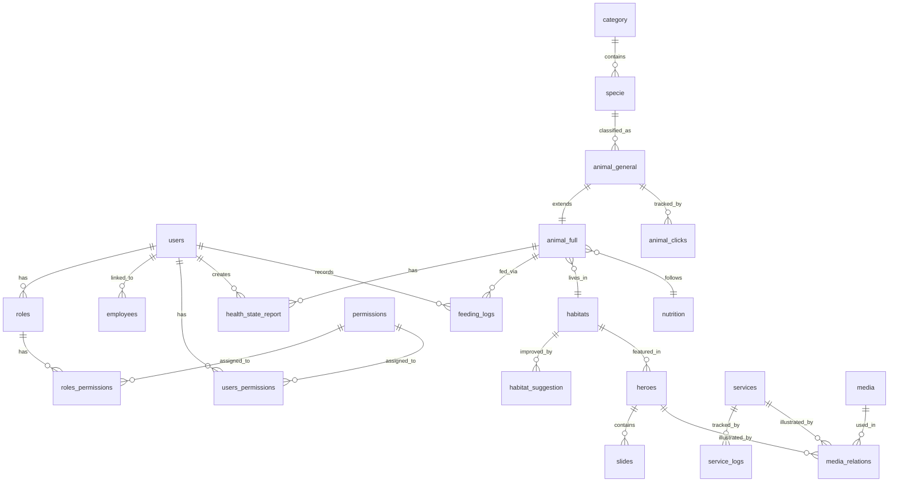

Explore the complete database schema for Zoo Arcadia, including all tables, relationships, and data models.

## Overview

The Zoo Arcadia database uses **MariaDB 11.4** with **UTF-8mb4** character encoding to support emojis and international characters.

<Info>
  The database is automatically initialized using migration files in the `database/` directory.
</Info>

## Database Initialization

The database is created using a series of SQL migration files:

| File | Purpose |
|------|----------|
| `01_init.sql` | Create database and users |
| `02_tables.sql` | Define all tables |
| `03_constraints.sql` | Add foreign keys and indexes |
| `04_indexes.sql` | Additional indexes (empty) |
| `05_procedures.sql` | Stored procedures (empty) |
| `06_seed_data.sql` | Initial data |
| `07_cleanup.sql` | Maintenance queries |

### Configuration

The database uses these settings:

```sql
CREATE DATABASE zoo_arcadia
    DEFAULT CHARACTER SET utf8mb4
    DEFAULT COLLATE utf8mb4_unicode_ci;

SET SQL_MODE = 'STRICT_TRANS_TABLES,NO_ZERO_IN_DATE,NO_ZERO_DATE,ERROR_FOR_DIVISION_BY_ZERO,NO_ENGINE_SUBSTITUTION';
SET time_zone = '+00:00';
SET default_storage_engine = InnoDB;
```

## Database Users

Two users are created for different access levels:

<Tabs>
  <Tab title="zoo_admin">
    **Full administrative access**
    
    ```sql
    CREATE USER 'zoo_admin'@'localhost' IDENTIFIED BY 'secure_password';
    GRANT ALL PRIVILEGES ON zoo_arcadia.* TO 'zoo_admin'@'localhost';
    ```
    
    Used for:
    - Database migrations
    - Schema modifications
    - Backup operations
  </Tab>
  
  <Tab title="zoo_app">
    **Application-level access**
    
    ```sql
    CREATE USER 'zoo_app'@'localhost' IDENTIFIED BY 'app_password';
    GRANT SELECT, INSERT, UPDATE, DELETE ON zoo_arcadia.* TO 'zoo_app'@'localhost';
    ```
    
    Used for:
    - Runtime application queries
    - CRUD operations
    - Standard data access
  </Tab>
</Tabs>

## Core Tables

### User Management

<AccordionGroup>
  <Accordion title="users - User Accounts">
    Stores system user accounts and authentication.
    
    ```sql
    CREATE TABLE users (
        id_user INT AUTO_INCREMENT PRIMARY KEY,
        username VARCHAR(50) NOT NULL UNIQUE,
        psw VARCHAR(255) NOT NULL,
        role_id INT DEFAULT NULL,
        employee_id INT NULL UNIQUE,
        is_active BOOLEAN NOT NULL DEFAULT TRUE,
        created_at TIMESTAMP DEFAULT CURRENT_TIMESTAMP,
        updated_at TIMESTAMP DEFAULT CURRENT_TIMESTAMP ON UPDATE CURRENT_TIMESTAMP,
        FOREIGN KEY (role_id) REFERENCES roles(id_role) ON DELETE SET NULL,
        FOREIGN KEY (employee_id) REFERENCES employees(id_employee) ON DELETE SET NULL
    );
    ```
    
    **Key Fields**:
    - `psw`: Hashed password (use `password_hash()` in PHP)
    - `is_active`: Enable/disable accounts without deletion
    - `role_id`: Links to roles table
    - `employee_id`: Optional link to employee data
  </Accordion>
  
  <Accordion title="employees - Employee Information">
    Stores detailed employee personal information.
    
    ```sql
    CREATE TABLE employees (
        id_employee INT AUTO_INCREMENT PRIMARY KEY,
        first_name VARCHAR(50) NOT NULL,
        last_name VARCHAR(50) NOT NULL,
        email VARCHAR(100) NOT NULL UNIQUE,
        birthdate DATE NOT NULL,
        phone VARCHAR(15) NOT NULL,
        address VARCHAR(255) NOT NULL,
        city VARCHAR(100) NOT NULL,
        country VARCHAR(100) NOT NULL,
        zip_code VARCHAR(10) NOT NULL,
        gender ENUM('male', 'female') NOT NULL,
        marital_status ENUM('single', 'married', 'divorced', 'widowed') NOT NULL,
        created_at TIMESTAMP DEFAULT CURRENT_TIMESTAMP,
        updated_at TIMESTAMP DEFAULT CURRENT_TIMESTAMP ON UPDATE CURRENT_TIMESTAMP
    );
    ```
    
    **Separation of Concerns**: Employee data is separate from user accounts to allow:
    - Employees without system access
    - Multiple accounts for one employee (if needed)
    - Privacy compliance (can delete account, keep employee record)
  </Accordion>
  
  <Accordion title="roles - User Roles">
    Defines role-based access control (RBAC).
    
    ```sql
    CREATE TABLE roles (
        id_role INT AUTO_INCREMENT PRIMARY KEY,
        role_name VARCHAR(50) NOT NULL UNIQUE,
        role_description TEXT,
        created_at TIMESTAMP DEFAULT CURRENT_TIMESTAMP,
        updated_at TIMESTAMP DEFAULT CURRENT_TIMESTAMP ON UPDATE CURRENT_TIMESTAMP
    );
    ```
    
    **Default Roles**:
    1. **Veterinary** - Animal health management
    2. **Employee** - General zoo operations
    3. **Admin** - Full system access
    4. **Accountant** - Financial operations
  </Accordion>
  
  <Accordion title="permissions - System Permissions">
    Granular permission definitions.
    
    ```sql
    CREATE TABLE permissions (
        id_permission INT AUTO_INCREMENT PRIMARY KEY,
        permission_name VARCHAR(100) NOT NULL UNIQUE,
        permission_desc TEXT
    );
    ```
    
    **Permission Categories**:
    - User management: `users-view`, `users-create`, `users-edit`, `users-delete`
    - Animal management: `animals-view`, `animals-create`, `animals-edit`, `animals-delete`
    - Veterinary: `vet_reports-create`, `vet_reports-view`, `vet_reports-edit`
    - Habitat management: `habitats-view`, `habitats-create`, `habitats-edit`
    - Services: `services-view`, `services-edit`
    - And more...
  </Accordion>
  
  <Accordion title="roles_permissions & users_permissions - Permission Assignment">
    Many-to-many relationships for flexible access control.
    
    ```sql
    -- Role-based permissions
    CREATE TABLE roles_permissions (
        role_id INT NOT NULL,
        permission_id INT NOT NULL,
        PRIMARY KEY (role_id, permission_id),
        FOREIGN KEY (role_id) REFERENCES roles(id_role) ON DELETE CASCADE,
        FOREIGN KEY (permission_id) REFERENCES permissions(id_permission) ON DELETE CASCADE
    );
    
    -- User-specific permissions (overrides)
    CREATE TABLE users_permissions (
        user_id INT NOT NULL,
        permission_id INT NOT NULL,
        PRIMARY KEY (user_id, permission_id),
        FOREIGN KEY (user_id) REFERENCES users(id_user) ON DELETE CASCADE,
        FOREIGN KEY (permission_id) REFERENCES permissions(id_permission) ON DELETE CASCADE
    );
    ```
    
    **Permission Hierarchy**:
    1. Check `users_permissions` (specific user permissions)
    2. Fall back to `roles_permissions` (role-based permissions)
  </Accordion>
</AccordionGroup>

### Animal Management

<AccordionGroup>
  <Accordion title="category - Animal Categories">
    Top-level animal classifications.
    
    ```sql
    CREATE TABLE category (
        id_category INT AUTO_INCREMENT PRIMARY KEY,
        category_name VARCHAR(50) NOT NULL UNIQUE
    );
    ```
    
    **Categories**: Mammal, Bird, Reptile, Amphibian, Arachnid, Insect
  </Accordion>
  
  <Accordion title="specie - Animal Species">
    Scientific species classifications.
    
    ```sql
    CREATE TABLE specie (
        id_specie INT AUTO_INCREMENT PRIMARY KEY,
        category_id INT NOT NULL,
        specie_name VARCHAR(200) NOT NULL,
        FOREIGN KEY (category_id) REFERENCES category(id_category) ON DELETE CASCADE
    );
    ```
    
    **Examples**:
    - `Panthera leo melanochaita` (African Lion)
    - `Acinonyx jubatus raineyi` (Cheetah)
    - `Ailuropoda melanoleuca` (Giant Panda)
  </Accordion>
  
  <Accordion title="animal_general - Basic Animal Info">
    Individual animal records.
    
    ```sql
    CREATE TABLE animal_general (
        id_animal_g INT AUTO_INCREMENT PRIMARY KEY,
        animal_name VARCHAR(50) NOT NULL,
        gender ENUM('male', 'female') NOT NULL,
        specie_id INT NOT NULL,
        FOREIGN KEY (specie_id) REFERENCES specie(id_specie) ON DELETE RESTRICT
    );
    ```
    
    **Design Note**: `ON DELETE RESTRICT` prevents deleting a species if animals exist.
  </Accordion>
  
  <Accordion title="animal_full - Complete Animal Profile">
    Links animal to habitat, nutrition, and health.
    
    ```sql
    CREATE TABLE animal_full (
        id_full_animal INT AUTO_INCREMENT PRIMARY KEY,
        animal_g_id INT NOT NULL,
        habitat_id INT NULL,
        nutrition_id INT NULL,
        created_at TIMESTAMP DEFAULT CURRENT_TIMESTAMP,
        updated_at TIMESTAMP DEFAULT CURRENT_TIMESTAMP ON UPDATE CURRENT_TIMESTAMP,
        FOREIGN KEY (animal_g_id) REFERENCES animal_general(id_animal_g) ON DELETE CASCADE,
        FOREIGN KEY (habitat_id) REFERENCES habitats(id_habitat) ON DELETE SET NULL,
        FOREIGN KEY (nutrition_id) REFERENCES nutrition(id_nutrition) ON DELETE SET NULL
    );
    ```
    
    **Relationships**:
    - One-to-one with `animal_general`
    - Many-to-one with `habitats`
    - Many-to-one with `nutrition`
  </Accordion>
  
  <Accordion title="animal_clicks - View Statistics">
    Tracks animal page views for analytics.
    
    ```sql
    CREATE TABLE animal_clicks (
        id_click INT AUTO_INCREMENT PRIMARY KEY,
        animal_g_id INT NOT NULL,
        year SMALLINT NOT NULL,
        month TINYINT NOT NULL CHECK (month BETWEEN 1 AND 12),
        click_count INT NOT NULL DEFAULT 0,
        updated_at TIMESTAMP DEFAULT CURRENT_TIMESTAMP ON UPDATE CURRENT_TIMESTAMP,
        FOREIGN KEY (animal_g_id) REFERENCES animal_general(id_animal_g) ON DELETE CASCADE,
        UNIQUE INDEX idx_animal_month_year (animal_g_id, year, month)
    );
    ```
    
    **Usage**: Increment `click_count` when an animal's detail page is viewed.
    
    **Cleanup**: The `07_cleanup.sql` script removes data older than 12 months.
  </Accordion>
</AccordionGroup>

### Health & Nutrition

<AccordionGroup>
  <Accordion title="nutrition - Feeding Plans">
    Defines nutrition requirements.
    
    ```sql
    CREATE TABLE nutrition (
        id_nutrition INT AUTO_INCREMENT PRIMARY KEY,
        nutrition_type ENUM('carnivorous', 'herbivorous', 'omnivorous') NOT NULL,
        food_type ENUM('meat', 'fruit', 'legumes', 'insect', 'fish', 'aquatic_plants', 'leaves', 'grass', 'vegetables', 'nectar') NOT NULL,
        food_qtty SMALLINT NOT NULL  -- Quantity in grams
    );
    ```
    
    **Examples**:
    - Carnivorous: 5kg meat for large felines
    - Herbivorous: 15kg grass for elephants
    - Omnivorous: 2kg fruit for monkeys
  </Accordion>
  
  <Accordion title="feeding_logs - Feeding Records">
    Tracks actual feeding events.
    
    ```sql
    CREATE TABLE feeding_logs (
        id_feeding_log INT AUTO_INCREMENT PRIMARY KEY,
        animal_f_id INT NOT NULL,
        user_id INT NULL,
        food_date TIMESTAMP DEFAULT CURRENT_TIMESTAMP,
        food_type ENUM('meat', 'fruit', 'legumes', 'insect') NOT NULL,
        food_qtty SMALLINT NOT NULL,
        FOREIGN KEY (animal_f_id) REFERENCES animal_full(id_full_animal) ON DELETE CASCADE,
        FOREIGN KEY (user_id) REFERENCES users(id_user) ON DELETE SET NULL
    );
    ```
    
    **Purpose**: Audit trail for feeding schedule compliance.
  </Accordion>
  
  <Accordion title="health_state_report - Veterinary Reports">
    Veterinary health assessments.
    
    ```sql
    CREATE TABLE health_state_report (
        id_hs_report INT AUTO_INCREMENT PRIMARY KEY,
        full_animal_id INT NOT NULL,
        hsr_state ENUM('healthy', 'sick', 'quarantined', 'injured', 'happy', 'sad', 
                       'depressed', 'terminal', 'infant', 'hungry', 'well', 
                       'good_condition', 'angry', 'aggressive', 'nervous', 'anxious', 
                       'recovering', 'pregnant', 'malnourished', 'dehydrated', 'stressed') NOT NULL,
        review_date TIMESTAMP NOT NULL DEFAULT CURRENT_TIMESTAMP,
        vet_obs TEXT NOT NULL,
        checked_by INT NULL,
        updated_at TIMESTAMP DEFAULT CURRENT_TIMESTAMP ON UPDATE CURRENT_TIMESTAMP,
        opt_details TEXT,
        FOREIGN KEY (full_animal_id) REFERENCES animal_full(id_full_animal) ON DELETE CASCADE,
        FOREIGN KEY (checked_by) REFERENCES users(id_user) ON DELETE SET NULL
    );
    ```
    
    **Workflow**:
    1. Veterinarian examines animal
    2. Creates report with state and observations
    3. Report is reviewed by admins
    4. Feeding plans adjusted if needed
  </Accordion>
</AccordionGroup>

### Habitats & Environment

<AccordionGroup>
  <Accordion title="habitats - Zoo Habitats">
    Main habitat areas.
    
    ```sql
    CREATE TABLE habitats (
        id_habitat INT AUTO_INCREMENT PRIMARY KEY,
        habitat_name VARCHAR(100) NOT NULL,
        description_habitat VARCHAR(50)
    );
    ```
    
    **Zoo Arcadia Habitats**:
    1. **Savannah** - African plains animals
    2. **Jungle** - Tropical rainforest species
    3. **Swamp** - Wetland creatures
  </Accordion>
  
  <Accordion title="habitat_suggestion - Improvement Suggestions">
    Veterinarian suggestions for habitat improvements.
    
    ```sql
    CREATE TABLE habitat_suggestion (
        id_hab_suggestion INT AUTO_INCREMENT PRIMARY KEY,
        habitat_id INT NOT NULL,
        suggested_by INT NULL,
        reviewed_by INT NULL,
        details TEXT NOT NULL,
        proposed_on TIMESTAMP DEFAULT CURRENT_TIMESTAMP,
        status ENUM('accepted', 'rejected', 'pending') DEFAULT 'pending',
        reviewed_on TIMESTAMP,
        deleted_by_admin TINYINT(1) DEFAULT 0,
        deleted_by_veterinarian TINYINT(1) DEFAULT 0,
        FOREIGN KEY (habitat_id) REFERENCES habitats(id_habitat) ON DELETE CASCADE,
        FOREIGN KEY (suggested_by) REFERENCES users(id_user) ON DELETE SET NULL,
        FOREIGN KEY (reviewed_by) REFERENCES users(id_user) ON DELETE SET NULL
    );
    ```
    
    **Soft Delete**: Instead of hard deleting, records are marked as deleted by role.
  </Accordion>
</AccordionGroup>

### Services & Content

<AccordionGroup>
  <Accordion title="services - Zoo Services">
    Services offered to visitors.
    
    ```sql
    CREATE TABLE services (
        id_service INT AUTO_INCREMENT PRIMARY KEY,
        service_title VARCHAR(50) NOT NULL,
        service_description VARCHAR(100) NOT NULL,
        link VARCHAR(255) NULL,
        type ENUM('service', 'habitat', 'featured') NOT NULL DEFAULT 'service',
        created_at TIMESTAMP DEFAULT CURRENT_TIMESTAMP,
        updated_at TIMESTAMP DEFAULT CURRENT_TIMESTAMP ON UPDATE CURRENT_TIMESTAMP
    );
    ```
    
    **Types**:
    - `service`: Regular services (Restaurant, Guide, Train)
    - `habitat`: Habitat navigation cards
    - `featured`: Homepage featured sections
  </Accordion>
  
  <Accordion title="service_logs - Service Change History">
    Audit trail for service modifications.
    
    ```sql
    CREATE TABLE service_logs (
        id_service_log INT AUTO_INCREMENT PRIMARY KEY,
        service_id INT NOT NULL,
        changed_by INT NOT NULL,
        action ENUM('create', 'update', 'delete') NOT NULL,
        field_name VARCHAR(50) NULL,
        previous_value TEXT NULL,
        new_value TEXT NULL,
        change_date TIMESTAMP DEFAULT CURRENT_TIMESTAMP,
        FOREIGN KEY (service_id) REFERENCES services(id_service) ON DELETE CASCADE,
        FOREIGN KEY (changed_by) REFERENCES users(id_user) ON DELETE CASCADE
    );
    ```
  </Accordion>
  
  <Accordion title="opening - Opening Hours">
    Zoo schedule configuration.
    
    ```sql
    CREATE TABLE opening (
        id_opening INT AUTO_INCREMENT PRIMARY KEY,
        time_slot ENUM('Monday', 'Tuesday', 'Wednesday', 'Thursday', 'Friday', 'Saturday', 'Sunday') NOT NULL,
        opening_time TIME NOT NULL,
        closing_time TIME NOT NULL,
        status ENUM('open', 'closed') NOT NULL DEFAULT 'open',
        updated_at TIMESTAMP DEFAULT CURRENT_TIMESTAMP ON UPDATE CURRENT_TIMESTAMP
    );
    ```
  </Accordion>
</AccordionGroup>

### CMS & Media

<AccordionGroup>
  <Accordion title="media - Media Files">
    Stores responsive images and media.
    
    ```sql
    CREATE TABLE media (
        id_media INT AUTO_INCREMENT PRIMARY KEY,
        media_path VARCHAR(2048) NOT NULL,         -- Mobile
        media_path_medium VARCHAR(2048),           -- Tablet
        media_path_large VARCHAR(2048),            -- Desktop
        media_type ENUM('image', 'video', 'audio') NOT NULL,
        description VARCHAR(255),
        created_at TIMESTAMP DEFAULT CURRENT_TIMESTAMP,
        updated_at TIMESTAMP DEFAULT CURRENT_TIMESTAMP ON UPDATE CURRENT_TIMESTAMP
    );
    ```
    
    **Responsive Images**: Three sizes for optimal performance on all devices.
  </Accordion>
  
  <Accordion title="media_relations - Polymorphic Relationships">
    Links media to any table using a polymorphic pattern.
    
    ```sql
    CREATE TABLE media_relations (
        id_relation INT AUTO_INCREMENT PRIMARY KEY,
        media_id INT NOT NULL,
        related_table VARCHAR(50) NOT NULL,  -- 'services', 'habitats', 'heroes', etc.
        related_id INT NOT NULL,             -- ID in the related table
        usage_type VARCHAR(100),             -- 'main', 'thumbnail', 'gallery', etc.
        created_at TIMESTAMP DEFAULT CURRENT_TIMESTAMP,
        updated_at TIMESTAMP DEFAULT CURRENT_TIMESTAMP ON UPDATE CURRENT_TIMESTAMP,
        FOREIGN KEY (media_id) REFERENCES media(id_media) ON DELETE CASCADE
    );
    ```
    
    **Example Query**:
    ```sql
    -- Get all images for a service
    SELECT m.* FROM media m
    JOIN media_relations mr ON m.id_media = mr.media_id
    WHERE mr.related_table = 'services' AND mr.related_id = 103;
    ```
  </Accordion>
  
  <Accordion title="heroes - Page Heroes">
    Hero sections for pages.
    
    ```sql
    CREATE TABLE heroes (
        id_hero INT AUTO_INCREMENT PRIMARY KEY,
        hero_title VARCHAR(100) NOT NULL,
        hero_subtitle VARCHAR(100),
        page_name ENUM('home', 'about', 'services', 'habitats', 'animals') NOT NULL,
        habitat_id INT NULL,
        has_sliders BOOLEAN DEFAULT FALSE,
        created_at TIMESTAMP DEFAULT CURRENT_TIMESTAMP,
        updated_at TIMESTAMP DEFAULT CURRENT_TIMESTAMP ON UPDATE CURRENT_TIMESTAMP,
        UNIQUE KEY unique_page_hero (page_name, habitat_id),
        FOREIGN KEY (habitat_id) REFERENCES habitats(id_habitat) ON DELETE CASCADE
    );
    ```
    
    **Flexible Design**: Can be page-specific or habitat-specific.
  </Accordion>
  
  <Accordion title="slides - Carousel Slides">
    Carousel content for heroes.
    
    ```sql
    CREATE TABLE slides (
        id_slide INT AUTO_INCREMENT PRIMARY KEY,
        hero_id INT NOT NULL,
        title_caption VARCHAR(255) NOT NULL,
        description_caption TEXT NOT NULL,
        created_at TIMESTAMP DEFAULT CURRENT_TIMESTAMP,
        updated_at TIMESTAMP DEFAULT CURRENT_TIMESTAMP ON UPDATE CURRENT_TIMESTAMP,
        FOREIGN KEY (hero_id) REFERENCES heroes(id_hero) ON DELETE CASCADE
    );
    ```
  </Accordion>
  
  <Accordion title="bricks - Content Blocks">
    Reusable content sections.
    
    ```sql
    CREATE TABLE bricks (
        id_brick INT AUTO_INCREMENT PRIMARY KEY,
        title VARCHAR(100) NOT NULL,
        description TEXT NOT NULL,
        link VARCHAR(255),
        page_name ENUM('home', 'about', 'services', 'habitats', 'animals', 'contact') NOT NULL,
        created_at TIMESTAMP DEFAULT CURRENT_TIMESTAMP,
        updated_at TIMESTAMP DEFAULT CURRENT_TIMESTAMP ON UPDATE CURRENT_TIMESTAMP
    );
    ```
  </Accordion>
</AccordionGroup>

### Public Interaction

<AccordionGroup>
  <Accordion title="testimonials - Visitor Reviews">
    Public testimonials with moderation.
    
    ```sql
    CREATE TABLE testimonials (
        id_testimonial INT AUTO_INCREMENT PRIMARY KEY,
        pseudo VARCHAR(100) CHARACTER SET utf8mb4 COLLATE utf8mb4_unicode_ci NOT NULL,
        message TEXT CHARACTER SET utf8mb4 COLLATE utf8mb4_unicode_ci NOT NULL,
        rating TINYINT UNSIGNED NOT NULL CHECK (rating BETWEEN 1 AND 5),
        status ENUM('pending', 'validated', 'rejected') DEFAULT 'pending',
        created_at TIMESTAMP DEFAULT CURRENT_TIMESTAMP,
        updated_at TIMESTAMP DEFAULT CURRENT_TIMESTAMP ON UPDATE CURRENT_TIMESTAMP,
        validated_at TIMESTAMP NULL DEFAULT NULL,
        validated_by INT DEFAULT NULL,
        FOREIGN KEY (validated_by) REFERENCES users(id_user) ON DELETE SET NULL
    ) CHARACTER SET utf8mb4 COLLATE utf8mb4_unicode_ci;
    ```
    
    **Moderation Workflow**:
    1. Visitor submits testimonial (status: `pending`)
    2. Employee reviews and validates/rejects
    3. Only `validated` testimonials appear publicly
  </Accordion>
  
  <Accordion title="form_contact - Contact Form Submissions">
    Contact form messages.
    
    ```sql
    CREATE TABLE form_contact (
        id_form INT AUTO_INCREMENT PRIMARY KEY,
        ff_name VARCHAR(50) CHARACTER SET utf8mb4 COLLATE utf8mb4_unicode_ci NOT NULL,
        fl_name VARCHAR(50) CHARACTER SET utf8mb4 COLLATE utf8mb4_unicode_ci NOT NULL,
        f_email VARCHAR(100) NOT NULL,
        f_subject VARCHAR(100) CHARACTER SET utf8mb4 COLLATE utf8mb4_unicode_ci,
        f_message TEXT CHARACTER SET utf8mb4 COLLATE utf8mb4_unicode_ci NOT NULL,
        f_sent_date TIMESTAMP DEFAULT CURRENT_TIMESTAMP,
        email_sent BOOLEAN DEFAULT FALSE
    ) CHARACTER SET utf8mb4 COLLATE utf8mb4_unicode_ci;
    ```
    
    **Email Queue**: `email_sent` flag tracks if the message was emailed to the zoo.
    
    **Indexes**:
    - `idx_sent_date` for cleanup queries
    - `idx_email` for filtering by sender
  </Accordion>
</AccordionGroup>

## Entity Relationships



## Indexes

Optimization indexes defined in `03_constraints.sql`:

```sql
-- Prevent duplicate click records
CREATE UNIQUE INDEX idx_animal_month_year ON animal_clicks (animal_g_id, year, month);

-- Speed up date range queries
CREATE INDEX idx_year_month ON animal_clicks (year, month);

-- Contact form queries
CREATE INDEX idx_sent_date ON form_contact (f_sent_date);
CREATE INDEX idx_email ON form_contact (f_email);
```

## Seed Data

The `06_seed_data.sql` file populates:

- **Roles**: Admin, Veterinary, Employee, Accountant
- **Permissions**: 35 granular permissions
- **Employees**: 31 sample employees
- **Users**: 32 user accounts
- **Categories**: 6 animal categories
- **Species**: 96 species (mammals, birds, reptiles, amphibians)
- **Habitats**: Savannah, Jungle, Swamp
- **Services**: 9 services (restaurant, guide, train, habitats)
- **Media**: 18 responsive image sets
- **Heroes**: 8 hero sections
- **Slides**: 3 carousel slides
- **Nutrition Plans**: 34 feeding plans
- **Opening Hours**: 7 days of schedules

<Note>
  All animal names, species, and data are realistic examples for demonstration purposes.
</Note>

## Maintenance

The `07_cleanup.sql` script provides automated cleanup queries:

<Tabs>
  <Tab title="Animal Clicks Cleanup">
    Keep only the last 12 months of click data:
    
    ```sql
    DELETE FROM animal_clicks 
    WHERE year < YEAR(CURDATE()) - 1 
       OR (year = YEAR(CURDATE()) - 1 AND month < MONTH(CURDATE()));
    ```
    
    **Schedule**: Run monthly via cron job
  </Tab>
  
  <Tab title="Contact Form Cleanup">
    Remove sent emails older than 6 months:
    
    ```sql
    DELETE FROM form_contact 
    WHERE email_sent = TRUE 
      AND f_sent_date < DATE_SUB(NOW(), INTERVAL 6 MONTH);
    ```
    
    **Schedule**: Run monthly
  </Tab>
</Tabs>

## Best Practices

<CardGroup cols={2}>
  <Card title="Always Use Transactions" icon="shield">
    Wrap multi-table operations in transactions to maintain data integrity.
  </Card>
  
  <Card title="Password Hashing" icon="lock">
    Use `password_hash()` and `password_verify()` for user passwords.
  </Card>
  
  <Card title="Soft Deletes" icon="trash">
    Use status flags instead of hard deletes for important records.
  </Card>
  
  <Card title="Prepared Statements" icon="code">
    Always use prepared statements to prevent SQL injection.
  </Card>
</CardGroup>

## Next Steps

<CardGroup cols={2}>
  <Card title="Environment Setup" icon="gear" href="/development/environment-setup">
    Initialize the database locally
  </Card>
  <Card title="Docker Deployment" icon="docker" href="/development/docker-deployment">
    Run the database in Docker
  </Card>
  <Card title="API Reference" icon="book" href="/api/overview">
    Explore API endpoints
  </Card>
  <Card title="Architecture Overview" icon="sitemap" href="/architecture/overview">
    Learn the PHP backend architecture
  </Card>
</CardGroup>