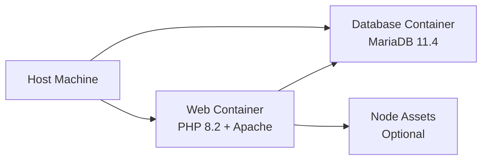

Deploy Zoo Arcadia in containerized environments using Docker for consistent development and production setups.

## Prerequisites

Ensure you have Docker and Docker Compose installed:

<CardGroup cols={2}>
  <Card title="Docker" icon="docker">
    Version 20.10 or higher
  </Card>
  <Card title="Docker Compose" icon="layer-group">
    Version 2.0 or higher
  </Card>
</CardGroup>

Verify installation:

```bash
docker --version
docker compose version
```

## Architecture Overview

The Docker setup consists of three services:



## Docker Compose Configuration

The `docker-compose.yml` defines the complete stack:

```yaml docker-compose.yml
version: '3.8'

services:
  # PHP + Apache Web Server
  web:
    build:
      context: .
      dockerfile: Dockerfile
    container_name: zoo-arcadia-web
    ports:
      - "8080:80"
    volumes:
      - ./public:/var/www/html/public
      - ./App:/var/www/html/App
      - ./includes:/var/www/html/includes
      - ./config.php:/var/www/html/config.php
      - ./.env:/var/www/html/.env
    depends_on:
      - db
    environment:
      - DB_HOST=db
      - DB_NAME=zoo_arcadia
      - DB_USER=zoo_user
      - DB_PASS=zoo_password
    networks:
      - zoo-network

  # MariaDB Database
  db:
    image: mariadb:11.4
    container_name: zoo-arcadia-db
    ports:
      - "3306:3306"
    environment:
      MYSQL_ROOT_PASSWORD: root_password
      MYSQL_DATABASE: zoo_arcadia
      MYSQL_USER: zoo_user
      MYSQL_PASSWORD: zoo_password
    volumes:
      - mysql_data:/var/lib/mysql
      - ./database:/docker-entrypoint-initdb.d
    networks:
      - zoo-network
    command: --default-authentication-plugin=mysql_native_password --character-set-server=utf8mb4 --collation-server=utf8mb4_unicode_ci

volumes:
  mysql_data:

networks:
  zoo-network:
    driver: bridge
```

### Service Breakdown

<Tabs>
  <Tab title="Web Service">
    **Container**: `zoo-arcadia-web`
    
    - **Base Image**: Custom Dockerfile (PHP 8.2 + Apache)
    - **Port**: 8080 (host) → 80 (container)
    - **Volumes**: Code directories mounted for live editing
    - **Environment**: Database credentials
    
    The web container includes:
    - PHP extensions (GD, PDO MySQL, Zip)
    - Apache with mod_rewrite enabled
    - Composer dependencies
    - Node.js 18 for asset compilation
  </Tab>
  
  <Tab title="Database Service">
    **Container**: `zoo-arcadia-db`
    
    - **Image**: MariaDB 11.4 (official)
    - **Port**: 3306 (both host and container)
    - **Persistent Storage**: `mysql_data` volume
    - **Auto-initialization**: SQL scripts in `database/` directory
    
    Features:
    - UTF-8mb4 character set (emoji support)
    - MySQL native password authentication
    - Auto-runs migration scripts on first start
  </Tab>
  
  <Tab title="Network">
    **Network**: `zoo-network`
    
    - **Driver**: Bridge
    - **Purpose**: Internal service communication
    
    Services communicate using container names:
    - Web → Database: `db:3306`
  </Tab>
</Tabs>

## Dockerfile

The custom Dockerfile builds the web application container:

<Accordion title="View Complete Dockerfile">
```dockerfile Dockerfile
# Base image: PHP 8.2 with Apache
FROM php:8.2-apache

# Install PHP extensions
RUN apt-get update && apt-get install -y \
    libpng-dev \
    libjpeg-dev \
    libfreetype6-dev \
    libzip-dev \
    unzip \
    git \
    curl \
    && docker-php-ext-configure gd --with-freetype --with-jpeg \
    && docker-php-ext-install -j$(nproc) gd pdo pdo_mysql zip \
    && apt-get clean \
    && rm -rf /var/lib/apt/lists/*

# Install Node.js 18
RUN curl -fsSL https://deb.nodesource.com/setup_18.x | bash - \
    && apt-get install -y nodejs

# Enable Apache modules
RUN a2enmod rewrite headers

# Copy Apache configuration
COPY docker/apache-config.conf /etc/apache2/sites-available/000-default.conf

# Set working directory
WORKDIR /var/www/html

# Install Composer
COPY --from=composer:latest /usr/bin/composer /usr/bin/composer

# Install PHP dependencies
COPY composer.json composer.lock ./
RUN composer install --no-dev --optimize-autoloader --no-interaction

# Install Node.js dependencies
COPY package.json package-lock.json ./
RUN npm ci --production=false

# Copy application files
COPY . .

# Build assets (CSS and JS)
RUN npx gulp buildCss || (npm run css || echo "Warning: CSS compilation failed") \
    && npx gulp buildJs || echo "Warning: JS build failed"

# Set permissions
RUN chown -R www-data:www-data /var/www/html \
    && chmod -R 755 /var/www/html

EXPOSE 80

CMD ["apache2-foreground"]
```
</Accordion>

## Getting Started with Docker

<Steps>
  <Step title="Configure Environment">
    Ensure you have the Docker-specific `.env` file:
    
    ```bash
    cp .env.example .env
    ```
    
    Or use the helper script (Windows):
    
    ```bash
    switch-to-docker.bat
    ```
    
    Key settings for Docker:
    
    ```bash .env
    DB_HOST=db  # Container name, not localhost
    DB_NAME=zoo_arcadia
    DB_USER=zoo_user
    DB_PASS=zoo_password
    ```
  </Step>

  <Step title="Build Containers">
    Build the Docker images:
    
    ```bash
    docker compose build
    ```
    
    <Note>
      First build may take 5-10 minutes as it downloads base images and compiles assets.
    </Note>
  </Step>

  <Step title="Start Services">
    Start all containers:
    
    ```bash
    docker compose up -d
    ```
    
    The `-d` flag runs containers in detached mode (background).
  </Step>

  <Step title="Verify Services">
    Check container status:
    
    ```bash
    docker compose ps
    ```
    
    You should see:
    
    ```
    NAME                STATUS      PORTS
    zoo-arcadia-web     Up          0.0.0.0:8080->80/tcp
    zoo-arcadia-db      Up          0.0.0.0:3306->3306/tcp
    ```
  </Step>

  <Step title="Access the Application">
    Open your browser to:
    
    ```
    http://localhost:8080
    ```
    
    The application should be running with a fully initialized database.
  </Step>
</Steps>

## Accessing Services

### Web Application

```
http://localhost:8080
```

### Database Connection

Connect to MariaDB from your host machine:

<CodeGroup>
```bash MySQL CLI
mysql -h 127.0.0.1 -P 3306 -u zoo_user -p
# Password: zoo_password
```

```bash Docker Exec
docker compose exec db mysql -u zoo_user -p zoo_arcadia
```
</CodeGroup>

### Container Logs

View real-time logs:

<CodeGroup>
```bash All Services
docker compose logs -f
```

```bash Web Only
docker compose logs -f web
```

```bash Database Only
docker compose logs -f db
```
</CodeGroup>

## Volume Management

Docker uses volumes for persistent data and development:

### Development Volumes (Bind Mounts)

These directories are mounted from your host machine for live editing:

| Host Path | Container Path | Purpose |
|-----------|----------------|----------|
| `./public` | `/var/www/html/public` | Frontend assets |
| `./App` | `/var/www/html/App` | PHP application code |
| `./includes` | `/var/www/html/includes` | Shared PHP includes |
| `./config.php` | `/var/www/html/config.php` | Configuration |
| `./.env` | `/var/www/html/.env` | Environment variables |

<Note>
  Changes to these files on your host are immediately reflected in the container.
</Note>

### Persistent Volume

The database uses a Docker volume for data persistence:

```bash
# List volumes
docker volume ls

# Inspect the database volume
docker volume inspect zoo-arcadia_mysql_data

# Remove volume (⚠️ destroys all data)
docker volume rm zoo-arcadia_mysql_data
```

## Database Migrations in Docker

The database is automatically initialized on first run using the `/docker-entrypoint-initdb.d` directory.

### Auto-initialization

SQL scripts in `database/` are executed in alphabetical order:

1. `01_init.sql` - Create database and users
2. `02_tables.sql` - Create all tables
3. `03_constraints.sql` - Add foreign keys
4. `04_indexes.sql` - Create indexes (if exists)
5. `05_procedures.sql` - Stored procedures (if exists)
6. `06_seed_data.sql` - Initial data
7. `07_cleanup.sql` - Cleanup tasks (if exists)

### Manual Migration

To re-run migrations:

<Steps>
  <Step title="Stop Containers">
    ```bash
    docker compose down
    ```
  </Step>
  
  <Step title="Remove Database Volume">
    ```bash
    docker volume rm zoo-arcadia_mysql_data
    ```
  </Step>
  
  <Step title="Restart Services">
    ```bash
    docker compose up -d
    ```
    
    The database will be recreated automatically.
  </Step>
</Steps>

### Execute SQL Scripts Manually

```bash
# Copy SQL file into container
docker compose cp database/02_tables.sql db:/tmp/

# Execute the script
docker compose exec db mysql -u root -proot_password zoo_arcadia < /tmp/02_tables.sql
```

## Common Docker Commands

<Tabs>
  <Tab title="Start/Stop">
    ```bash
    # Start all services
    docker compose up -d
    
    # Stop all services
    docker compose down
    
    # Stop and remove volumes
    docker compose down -v
    
    # Restart a specific service
    docker compose restart web
    ```
  </Tab>
  
  <Tab title="Build/Rebuild">
    ```bash
    # Build images
    docker compose build
    
    # Rebuild without cache
    docker compose build --no-cache
    
    # Build and start
    docker compose up -d --build
    ```
  </Tab>
  
  <Tab title="Execute Commands">
    ```bash
    # Shell into web container
    docker compose exec web bash
    
    # Shell into database container
    docker compose exec db bash
    
    # Run Composer
    docker compose exec web composer install
    
    # Run Gulp tasks
    docker compose exec web npx gulp buildCss
    ```
  </Tab>
  
  <Tab title="Inspect/Debug">
    ```bash
    # View logs
    docker compose logs -f
    
    # Check resource usage
    docker stats
    
    # List containers
    docker compose ps
    
    # Inspect a container
    docker inspect zoo-arcadia-web
    ```
  </Tab>
</Tabs>

## Troubleshooting

<AccordionGroup>
  <Accordion title="Container Won't Start">
    **Check logs**:
    ```bash
    docker compose logs web
    docker compose logs db
    ```
    
    **Common causes**:
    - Port already in use (change ports in `docker-compose.yml`)
    - Insufficient disk space
    - Missing `.env` file
  </Accordion>
  
  <Accordion title="Database Connection Failed">
    **Verify database is running**:
    ```bash
    docker compose ps db
    ```
    
    **Check credentials**:
    - Ensure `.env` has `DB_HOST=db` (not `localhost`)
    - Verify credentials match `docker-compose.yml`
    
    **Test connection**:
    ```bash
    docker compose exec web php -r "echo new PDO('mysql:host=db;dbname=zoo_arcadia', 'zoo_user', 'zoo_password');"
    ```
  </Accordion>
  
  <Accordion title="Assets Not Compiling">
    **Rebuild with fresh dependencies**:
    ```bash
    docker compose down
    docker compose build --no-cache
    docker compose up -d
    ```
    
    **Check Node.js installation**:
    ```bash
    docker compose exec web node --version
    docker compose exec web npm --version
    ```
  </Accordion>
  
  <Accordion title="Changes Not Reflected">
    **For code changes**: Should be immediate (using bind mounts)
    
    **For config changes**: Restart the web service
    ```bash
    docker compose restart web
    ```
    
    **For Dockerfile changes**: Rebuild
    ```bash
    docker compose up -d --build
    ```
  </Accordion>
  
  <Accordion title="Port Already in Use">
    **Change the host port** in `docker-compose.yml`:
    
    ```yaml
    services:
      web:
        ports:
          - "8081:80"  # Changed from 8080
    ```
    
    Then restart:
    ```bash
    docker compose down
    docker compose up -d
    ```
  </Accordion>
</AccordionGroup>

## Production Deployment

For production deployments, consider these best practices:

<Steps>
  <Step title="Use Production Environment">
    Update `.env` for production:
    
    ```bash
    APP_ENV=production
    DB_PASS=<strong-password>
    ```
  </Step>
  
  <Step title="Remove Development Volumes">
    Don't mount source code in production. Remove bind mounts from `docker-compose.yml`:
    
    ```yaml
    # Remove these lines:
    volumes:
      - ./public:/var/www/html/public
      - ./App:/var/www/html/App
    ```
  </Step>
  
  <Step title="Use Docker Secrets">
    For sensitive data, use Docker secrets instead of environment variables.
  </Step>
  
  <Step title="Enable HTTPS">
    Use a reverse proxy (Nginx, Traefik) with SSL certificates.
  </Step>
  
  <Step title="Set Resource Limits">
    Add resource constraints:
    
    ```yaml
    services:
      web:
        deploy:
          resources:
            limits:
              cpus: '2'
              memory: 1G
    ```
  </Step>
</Steps>

<Warning>
  Never expose the database port (3306) to the internet in production.
</Warning>

## Next Steps

<CardGroup cols={2}>
  <Card title="Database Schema" icon="database" href="/development/database-schema">
    Explore the database structure
  </Card>
  <Card title="Environment Setup" icon="gear" href="/development/environment-setup">
    Configure local development without Docker
  </Card>
  <Card title="Asset Pipeline" icon="code" href="/development/asset-pipeline">
    Learn about asset compilation
  </Card>
  <Card title="Environment Setup" icon="gear" href="/development/environment-setup">
    Set up local development environment
  </Card>
</CardGroup>